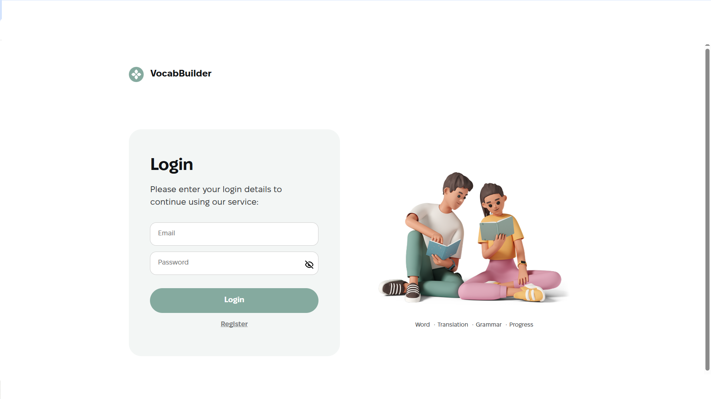
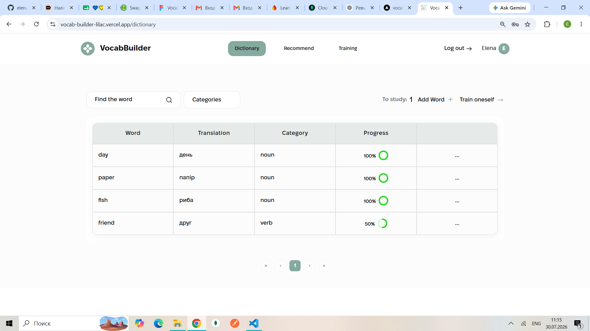
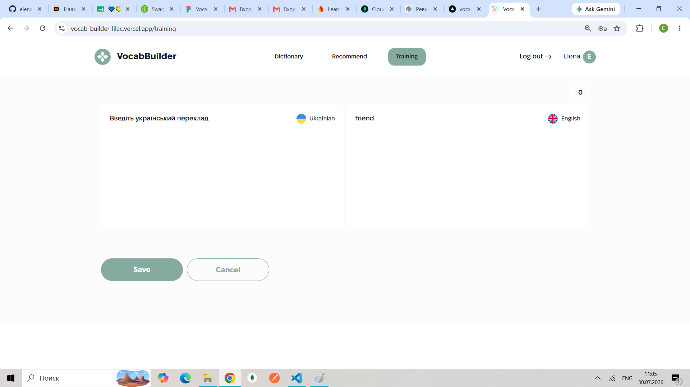
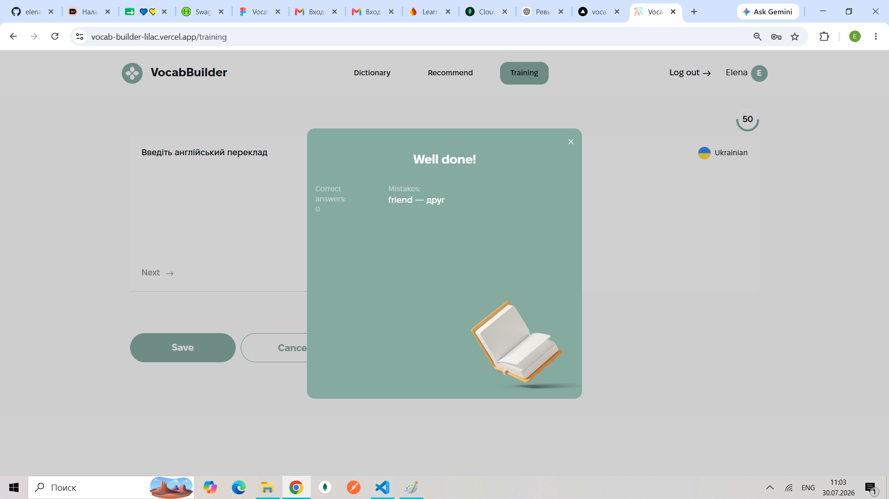

# VocabBuilder

VocabBuilder is a web application for learning and practicing English vocabulary.

The application allows users to build their personal vocabulary, practice new words, and track learning progress through interactive training.

## 🚀 Features

- User authentication (registration, login, logout)
- JWT token authorization
- Protected routes
- Personal dictionary
- Adding, editing, and deleting words
- Recommended words for learning
- Word filtering by category
- Interactive vocabulary training
- Learning progress tracking
- Statistics dashboard
- Responsive design for desktop, tablet, and mobile devices

## 🛠 Technologies

### Frontend

- React
- Vite
- Redux Toolkit
- React Router
- Axios
- React Hook Form
- Yup
- CSS Modules

### Tools

- Git
- GitHub
- Vercel
- ESLint

## 🔐 Authentication

Authentication is implemented using JWT tokens.

The application includes:

- User registration
- User login and logout
- Token storage in localStorage
- Automatic user session restoration after page reload
- Protected routes for authorized users

## 📚 Main Functionality

### Personal Dictionary

Users can:

- Add new words
- Edit existing words
- Delete words
- View personal vocabulary

### Recommended Words

Users can:

- Browse recommended words
- Filter words by category
- Select words for learning

### Training System

The training module provides:

- Interactive word exercises
- Checking user answers
- Progress updates
- Learning statistics

## 📦 Installation

Clone the repository:

```bash
git clone https://github.com/elena05-dev/vocab-builder.git
```

Install dependencies:

```bash
npm install
```

Start development server:

```bash
npm run dev
```

Create production build:

```bash
npm run build
```

Run ESLint:

```bash
npm run lint
```

## 🌐 Live Demo

https://vocab-builder-lilac.vercel.app/

## 📸 Screenshots

### Login



### Dictionary



### Training



### Statistics



## 👩‍💻 Author

Elena Polyakova

GitHub:
https://github.com/elena05-dev
